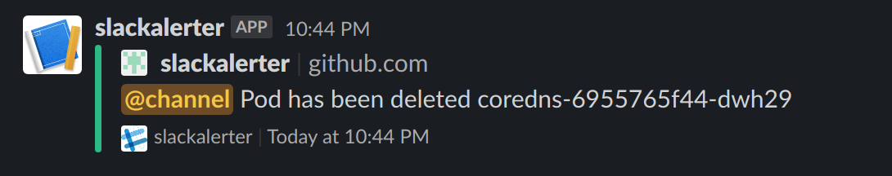

## Slackalerter

Built on [kubeops](github.com/AlexsJones/kubeops) this alerts in a slack channel when there are issues with pods being deleted.

## Installation

Play with this locally
- `make docker`
- `make publish`
- `cd helm`
- ` helm install . --generate-name --set="slackwebhookurl=<YOUR WEBHOOK>`